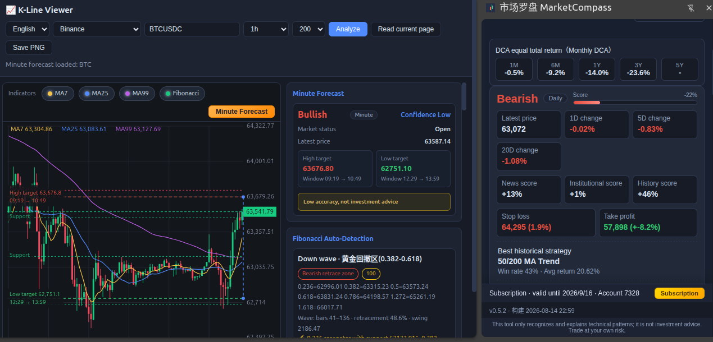
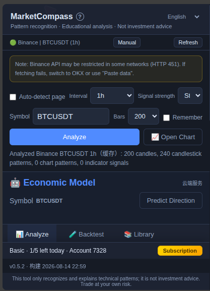
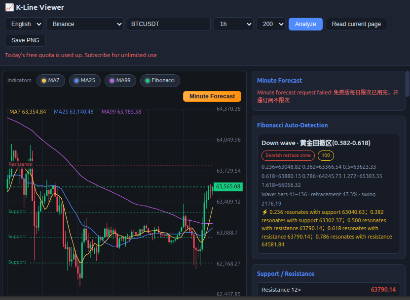
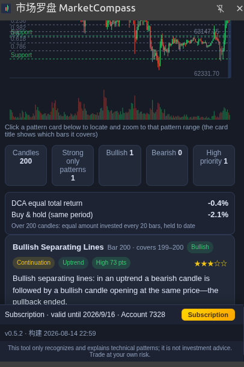

# MarketCompass (市场罗盘)

**K-Line Pattern Recognition & Market Data Enhancer for your browser**

MarketCompass is a browser extension that makes dense market data readable. It recognizes K-line candlestick patterns, overlays technical indicators, and auto-detects Fibonacci levels and support/resistance zones directly on the financial websites you already visit — no copy-paste, no switching tabs.

> Pattern recognition for educational use only. Not investment advice. Trade at your own risk.

---

## Features

- **Candlestick Pattern Recognition** — auto-detects engulfing, hammer, doji, harami and 200+ common patterns; labels name & range right on the chart
- **Indicator Overlays** — MA7 / MA25 / MA99, volume, and more, layered on the original chart in-place
- **Fibonacci Auto-Detection** — automatically finds swing waves and draws 0.236–1.618 retracement levels with support/resistance resonance hints
- **Support & Resistance** — clusters real price levels by touch count so you see where the market actually reacts
- **Market Data Enhancement** — groups, aligns and highlights quotes & tables for faster scanning
- **Independent Analysis Panel** — a side panel that works on any page; paste data or auto-detect from the open tab
- **Multilingual** — 中文 / English / 日本語 / 한국어

## Supported Platforms

| Crypto exchanges | Stock & market sites |
|---|---|
| Binance | Yahoo Finance (TW) |
| OKX | Tonghuashun (同花顺) |
| Bybit | Eastmoney (东方财富) |
| Bitget | Futu (富途) |
| | Xueqiu (雪球) |
| | TradingView |

Also supports futures sites (Sina Futures, Eastmoney Futures, Yahoo Futures) and global stocks:
A-shares (6-digit), US (`us:AAPL`), HK (`hk:00700`), JP (`jp:7203.T`), KR (`kr:005930.KS`).

## Screenshots

### Side Panel — pattern recognition & analysis

### Chart analysis

### Analysis results

## Privacy

- No account required, no tracking, no ads
- All pattern recognition runs locally in your browser
- Only sends the data you explicitly choose (cloud economy-model features are opt-in)
- We never collect browsing history or personal identity

## Install

- **Chrome**: available on the Chrome Web Store (search "MarketCompass")
- **Firefox**: available on Firefox Add-ons (search "MarketCompass")
- Manual install: load the unpacked extension from the latest release

## Releases

Binary packages and update manifests are published in the [Releases](https://github.com/haishidianmao/kline-insight-releases/releases) section of this repository.

## License

All rights reserved. Free tier available; premium subscription unlocks additional features.
